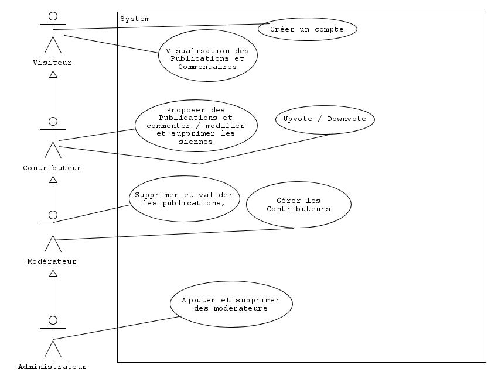

# Cahier des charges

## Contexte
Encyclopédie communautaire musicale.

## Objectifs
- Centraliser les informations sur des outils ou instruments en lien avec la musique:
  - Gain de temps lors de la recherche

- Partage d'avis sur l'objet
  - Fiabiliser les informations

## Acteurs
- Administrateur: Plus haut grade de gestion
- Modérateur: Modère les modifications sur les publications et les commentaires
- Contributeur: Publie, édite et commente 
- Visiteur: Peut accéder aux publications

## Périmètre du système

## Règles métiers
RGPD, lien vers site extérieur (conditions d'utilisations du site en question etc...).

## Description des cas d'utilisation

### Créer un compte
| Cas d'utilisation         | Nom                   |
|---------------------------|-----------------------|
| Acteur primaire           | Visiteur              |
| Système                   | Système global        |
| Date de création          | 20/04/2023            |
| Date de modification      | 20/04/2023            |
| Auteur de la modification | Côme PICARD           |
| Précondition              | Ne pas être identifié |

| Opérations :  | Description                               |
|---------------|-------------------------------------------|
| 1             | Choisir l'action de connexion             |
| 2             | Choisir l'option "Créer un compte"        |
| 3             | Renseigner les _informations_ du compte   |
| 4             | Le système envoie un code à l'utilisateur |
| 5             | Remplir le code envoyé par mail           |
| 6             | Confirmer la création du compte           |

## Exigences fonctionnelles
- Listing des objets
- Page de détail
- Filtrer les objets
- Possibilité de poster
- Gestion des utilisateurs
- Pouvoir upvote/downvote
- Possibilité de commenter

## Exigences non-fonctionnelles

## Contraintes

## Prestation attendues
1. [Planning]()
2. [Guide de démarrage]()
3. [Documentation]()
## Annexe

### Dictionnaire des données

| Nom                | Label              | Type               | Taille             |
|--------------------|--------------------|--------------------|--------------------|
| Colonne 1, Ligne 1 | Colonne 2, Ligne 1 | Colonne 3, Ligne 1 | Colonne 4, Ligne 1 |